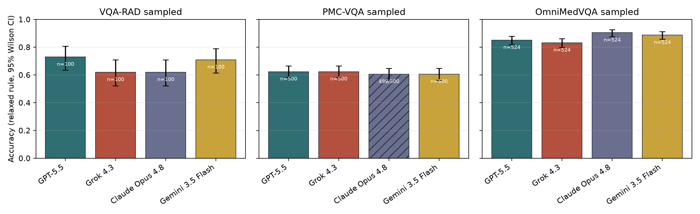

# Public-Subset Replication of Health-AI Readiness Benchmarks

**Public-Subset Replication of Health-AI Readiness Benchmarks With Updated Frontier Multimodal Models**

Author: **Koyar Afrasyab, M.D.**  
Affiliation: **Kinvectum AB**  
Funding: **Kinvectum AB**

This repository contains the code, saved model outputs, analysis tables, figures, manuscript, and supplementary material for a public-subset replication and model update of the Health-AI-Readiness evaluation framework released by Gu et al.

This is a **partial replication**, not a full reproduction of the original study. It updates the public benchmark layer using newer hosted frontier multimodal models, while explicitly excluding original-study components whose image assets were not redistributed or locally available.

## Quick Links

- [Manuscript PDF](paper/manuscript_results_filled.pdf)
- [Manuscript Markdown](paper/manuscript_results_filled.md)
- [Supplementary material](paper/supplementary_results_filled.md)
- [Primary summary table](analysis/updated_public/summary_by_model_dataset.csv)
- [Per-sample results](analysis/updated_public/per_sample_results.csv)
- [Result file manifest](result/README.md)
- [Original Gu et al. repository](https://github.com/aiden-ygu/health-ai-readiness-eval)

## Study Question

The original Health-AI-Readiness study asked whether high performance by frontier models on health AI benchmarks translated into robust and deployment-ready behavior. This update asks a narrower, reproducible question:

> How do newer hosted multimodal models perform on the public benchmark components that can be locally validated and redistributed, and what does that public layer fail to establish?

## Model Panel

Primary evaluated model panel:

| Model | Provider route | Configured identifier | Reasoning setting |
|---|---|---|---|
| GPT-5.5 | OpenAI Responses API | `gpt-5.5` | high |
| Grok 4.3 | xAI Responses-compatible API | `grok-4.3` | high/configurable |
| Claude Opus 4.8 | Anthropic Messages API | `claude-opus-4-8` | high/adaptive thinking |
| Gemini 3.5 Flash | Google Gemini API | `gemini-3.5-flash` | high thinking |

An exploratory Gemini 3.1 Pro run was quota-limited and is retained only as archived exploratory output. It is not part of the primary model panel.

## Benchmarks Included

Primary public benchmark run: `public_original_subset_v1`.

| Dataset | Prespecified count | Task type | Included |
|---|---:|---|---|
| VQA-RAD no-CoT subset | 100 | radiology VQA, open-ended and yes/no | yes |
| PMC-VQA sampled file | 500 | multiple-choice medical figure VQA | yes |
| OmniMedVQA sampled file | 524 | multiple-choice multimodal medical VQA | yes |

Restricted JAMA, NEJM, proprietary unseen-image, and visual-substitution/rationale stress-test assets were not included because the required images were absent locally and not redistributed by the upstream repository.

## Main Results

Relaxed automated accuracy is shown below. Confidence intervals and strict-scoring results are available in [`analysis/updated_public/summary_by_model_dataset.csv`](analysis/updated_public/summary_by_model_dataset.csv).

| Dataset | GPT-5.5 | Grok 4.3 | Claude Opus 4.8 | Gemini 3.5 Flash | Highest complete cell |
|---|---:|---:|---:|---:|---|
| VQA-RAD sampled | 73.0% | 62.0% | 62.0% | 71.0% | GPT-5.5 |
| PMC-VQA sampled | 62.4% | 62.4% | 60.5%* | 60.6% | GPT-5.5 / Grok 4.3 |
| OmniMedVQA sampled | 85.1% | 83.2% | 90.5% | 88.7% | Claude Opus 4.8 |

\* Claude Opus 4.8 on PMC-VQA reached 499/500 samples and is labelled incomplete in the analysis.

Across complete model-dataset cells, relaxed automated accuracy ranged from **60.6% to 90.5%**. The best complete cells were GPT-5.5 on VQA-RAD, GPT-5.5/Grok 4.3 on PMC-VQA, and Claude Opus 4.8 on OmniMedVQA.



## Key Conclusions

- Newer frontier multimodal models show strong results on parts of the reproducible public benchmark layer, especially OmniMedVQA.
- The results do **not** establish health-AI readiness or clinical deployment readiness.
- Standard public medical VQA scores remain incomplete evidence because the original stress-test layer could not be rerun without restricted image assets.
- Strict versus relaxed scoring materially changed interpretation on VQA-RAD and OmniMedVQA, showing that benchmark claims depend on scoring rules.
- Sampled no-image sensitivity runs suggest that some benchmark performance can be driven by text priors, option wording, or memorized associations rather than purely visual reasoning.
- Provider behavior itself affected reproducibility: quota limits, response-format anomalies, missing answer tags, and hosted-model drift are part of the empirical record.

## Limitations

This repository reports a public-subset model update, not a full reproduction of Gu et al.

Important limitations:

- JAMA, NEJM, unseen-image, and T5/T6 visual-substitution/rationale tests are excluded because required source images were unavailable.
- The analysis uses automated scoring; VQA-RAD open-ended answers would benefit from blinded clinical adjudication.
- Hosted API models can change after the run window, so exact replication may depend on provider-side model versioning.
- The no-image analysis is sampled and exploratory, not a replacement for the original restricted-image robustness battery.
- Large/raw public image folders are not included in this GitHub repository; only public metadata/sample files and saved outputs are included.

## Repository Contents

| Path | Contents |
|---|---|
| `paper/` | Manuscript PDF/DOCX/Markdown, supplementary material, release manifest, medRxiv checklist, references |
| `analysis/updated_public/` | Summary CSVs, per-sample results, paired comparisons, scoring sensitivity, no-image sensitivity, figures |
| `result/` | Saved model-output JSON files; see `result/README.md` for primary/sensitivity/smoke/exploratory labels |
| `src/`, `scripts/` | Benchmark runner code and public-subset scripts |
| `data/` | Public metadata/sample files and small sample images only |

## Reproduce Analysis From Saved Outputs

The saved result files are included. To regenerate analysis tables, figures, and manuscript artifacts from those saved outputs:

```bash
python analyze_updated_public_results.py
python build_paper_from_results.py
python build_pdf_from_paper.py
python build_docx_from_paper.py
```

This does not rerun paid API inference. Runtime credentials, `.env` files, API-key templates, and provider billing details are intentionally excluded.

## Attribution

This work builds on the original evaluation framework and research question from:

- Gu Y, Fu J, Liu X, Valanarasu JMJ, Codella NCF, Tan R, Liu Q, Jin Y, Zhang S, Wang J, et al. **Evaluating the robustness and readiness of large frontier models in health AI applications**. 2026.
- Original code repository: [`aiden-ygu/health-ai-readiness-eval`](https://github.com/aiden-ygu/health-ai-readiness-eval)

Benchmark sources used in the public subset include VQA-RAD, PMC-VQA, and OmniMedVQA. Full references are listed in [`paper/references.bib`](paper/references.bib).

## Citation

If citing this replication package, please cite both this repository and the original Gu et al. work that it partially replicates.

```bibtex
@misc{afrasyab2026publicsubsethealthaireadiness,
  title = {Public-Subset Replication of Health-AI Readiness Benchmarks With Updated Frontier Multimodal Models},
  author = {Afrasyab, Koyar},
  year = {2026},
  howpublished = {GitHub repository},
  url = {https://github.com/KAVentures/health-ai-readiness-public-subset-partial-replication}
}
```

## Funding and Competing Interests

This project was funded by Kinvectum AB. Koyar Afrasyab, M.D. is the founder of Kinvectum AB.

## License

Code and repository materials are released under the [MIT License](LICENSE), subject to the licensing terms of upstream datasets and third-party source materials.
