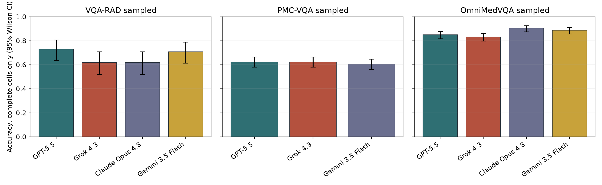
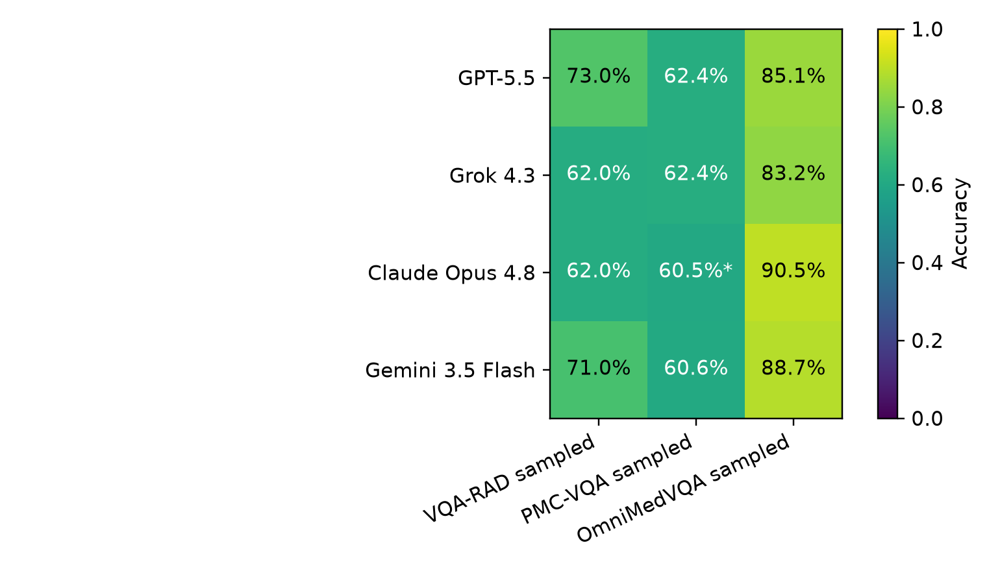
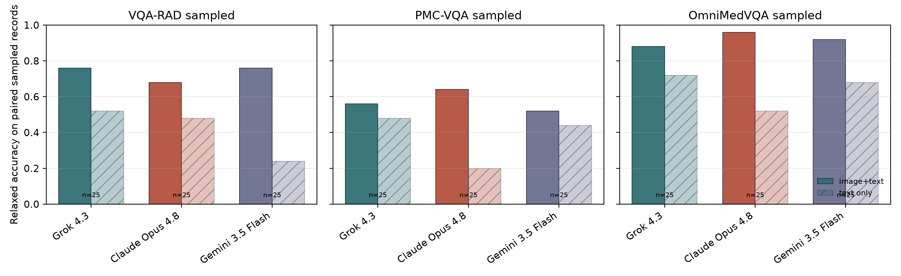

# Public-Subset Replication of Health-AI Readiness Benchmarks With Updated Frontier Multimodal Models

Koyar Afrasyab, M.D.

Affiliation: Kinvectum AB

## Abstract

**Background:** Gu and colleagues evaluated the robustness and readiness of frontier models for health AI applications and released an accompanying evaluation repository [1,2]. Rapid model turnover makes periodic replication useful, but several original-study image sources are restricted and not redistributed. This study therefore asks a narrower question: how do newer hosted frontier models perform on the reproducible public benchmark layer, and what does that layer fail to establish?

**Methods:** We adapted the original Health-AI-Readiness evaluation harness to API-hosted frontier models available during the June 28-30, 2026 run window: GPT-5.5, Grok 4.3, Claude Opus 4.8, and Gemini 3.5 Flash. The primary analysis used the locally validated public subsets available from the original repository workflow: VQA-RAD no-CoT (100 cases), PMC-VQA sampled (500 cases), and OmniMedVQA sampled (524 records). Restricted JAMA, NEJM, visual substitution, and unseen-image stress tests were excluded because the required images were not redistributed and were not locally available. Accuracy was summarized with Wilson 95% confidence intervals. Paired comparisons used exact McNemar tests on shared samples. We also report strict-versus-relaxed scoring sensitivity, representative discordant failures, provider-format anomalies, and a sampled text-only no-image sensitivity analysis when corresponding runs are available.

**Results:** 11 of 12 generated model-dataset cells reached the prespecified sample count. Incomplete cells were retained but labelled explicitly: Claude Opus 4.8 on PMC-VQA sampled (499/500). Across complete model-dataset cells, relaxed automated accuracy ranged from 60.6% to 90.5%. For VQA-RAD sampled, the highest relaxed automated accuracy among complete cells was 73.0% for GPT-5.5 (73/100; Wilson 95% CI 63.6%-80.7%). For PMC-VQA sampled, the highest relaxed automated accuracy among complete cells was 62.4% for GPT-5.5 (312/500; Wilson 95% CI 58.1%-66.5%). For OmniMedVQA sampled, the highest relaxed automated accuracy among complete cells was 90.5% for Claude Opus 4.8 (474/524; Wilson 95% CI 87.6%-92.7%). Strict and relaxed scoring did not behave as interchangeable endpoints. OmniMedVQA sampled mean gap 23.3 percentage points; PMC-VQA sampled mean gap 0.0 percentage points; VQA-RAD sampled mean gap 7.5 percentage points. The largest single model-dataset gap was 23.9 percentage points for Claude Opus 4.8 on OmniMedVQA sampled. An earlier Gemini 3.1 Pro exploratory run was abandoned after repeated quota limits and is not part of the primary model panel. Any remaining incomplete primary cells are reported for transparency and are not treated as full-subset estimates.

**Conclusions:** The updated public-subset replication provides a useful 2026 snapshot of newer hosted multimodal models on reproducible medical VQA benchmarks, but it does not establish health-AI readiness. The main value is methodological and comparative: it updates the public leaderboard, quantifies scoring and no-image sensitivity, and shows why restricted-image robustness tests remain necessary before clinical-readiness claims.

## Introduction

Medical visual question answering is a useful but narrow probe of multimodal model behavior in clinically flavored tasks. The original Health-AI-Readiness study argued that high benchmark performance can coexist with brittleness under adversarial or modality-altering perturbations [1,2]. Its released repository provides evaluation code, benchmark indices, prompt templates, stress-test specifications, and analysis utilities, while also documenting that raw JAMA, NEJM, proprietary unseen-set, and visual-substitution images are not redistributed [1,2].

This update has two aims. First, it adapts the original evaluation harness to a newer model panel. Second, it separates immediately reproducible public benchmark results from analyses that require restricted source materials. That separation is central to the claims made here: the paper reports a public-subset model update, not a complete re-run of every original study component. The comparison with Gu et al. is therefore framed as a scoped replication: it tests whether current models change the public-benchmark picture, while preserving the original paper's broader readiness question for a later restricted-asset phase [1,2].

The relevance of the study is practical rather than sweeping. Medical readers should not infer deployment readiness from these experiments, but they can use them to understand how quickly public benchmark baselines move, which model families warrant follow-up robustness testing, and where automated medical VQA evaluation remains brittle. The specific contributions are: an updated public-subset model panel; a reproducible audit of dataset availability; strict-versus-relaxed scoring sensitivity; sampled no-image sensitivity; representative discordant failures; and documentation of provider/API behaviors that affected reproducibility.

## Methods

### Study Design

This is a replication-oriented benchmark update using the cloned `aiden-ygu/health-ai-readiness-eval` repository as the source-of-truth evaluation harness. We preserved the repository's dataset configurations, prompt builders, result format, and redistributed public subset files where possible, while adding provider support for the newer target models.

### Benchmark Datasets

The primary public benchmark run was `public_original_subset_v1`:

| Dataset | Prespecified count | Task format | Included in primary public run |
|---|---:|---|---|
| VQA-RAD no-CoT subset | 100 | radiology VQA, open-ended and yes/no | yes |
| PMC-VQA sampled file | 500 | multiple-choice medical figure VQA | yes |
| OmniMedVQA sampled file | 524 | multiple-choice multimodal medical VQA | yes |

VQA-RAD contains clinically generated radiology image question-answer pairs [3]. PMC-VQA contains medical figure questions derived from PubMed Central open-access articles [4]. OmniMedVQA is a broad medical VQA benchmark spanning multiple modalities and medical subdomains [5]. For OmniMedVQA, the original download target was unavailable during setup, so the sampled records were matched to an accessible public archive and all referenced sampled images were extracted locally.

### Excluded Original-Study Components

The following original-study components were excluded from the primary analysis because required image assets were absent locally and not redistributed by the repository:

| Component | Reason for exclusion |
|---|---|
| JAMA Clinical Challenge | image assets not redistributed and not locally available |
| NEJM Image Challenge | image assets not redistributed and not locally available |
| NEJM stress tests ST_v0-ST_v8 | metadata present, but image assets absent |
| ST_v10 unseen-image set | JSON/images absent in the cloned repository |
| T5/T6 visual substitution/rationale tests | require restricted NEJM-derived image materials |

These are data-availability exclusions, not evidence that the omitted tests are unimportant. T5/T6 should be run as a secondary phase if the restricted images are supplied or reconstructed under a documented protocol.

### Model Panel and API Configuration

| Model key | Provider route | Configured model identifier | Reasoning setting | Run window |
|---|---|---|---|---|
| `gpt-5.5` | OpenAI Responses API | `gpt-5.5` | high | June 28-30, 2026 |
| `grok-4.3` | xAI Responses-compatible API | `grok-4.3` | high/configurable | June 28-30, 2026 |
| `claude-opus-4.8` | Anthropic Messages API | `claude-opus-4-8` | high/adaptive thinking | June 28-30, 2026 |
| `gemini-3.5-flash` | Google Gemini API | `gemini-3.5-flash` | high thinking | June 28-30, 2026 |

All four API routes passed low-volume smoke tests before benchmark runs. Smoke tests are reported only as plumbing checks, not as performance estimates. Gemini 3.1 Pro was initially tested but replaced by Gemini 3.5 Flash after repeated quota limits; the Gemini 3.1 Pro outputs remain archived locally but are excluded from the primary analysis. Hosted model outputs may change as providers update models or serving infrastructure; the run dates, model identifiers, reasoning settings, extraction rules, and saved response files are therefore part of the reproducibility record.

### Prompting and Scoring

We used the original repository prompt builders. PMC-VQA and OmniMedVQA prompts asked models to choose one provided option and place the answer inside `<answer></answer>` tags. VQA-RAD prompts requested concise free-text or yes/no answers in the same tag format.

The primary automated endpoint was per-dataset accuracy. For multiple-choice datasets, single-letter ground truths were scored by exact option-letter match; relaxed substring matching was deliberately disabled for one-character option labels because it can create false positives. For VQA-RAD, strict scoring used normalized string equality, while the relaxed rule allowed yes/no normalization and conservative short-answer containment. VQA-RAD results should still be interpreted with caution because deterministic matching may undercount clinically equivalent free-text answers.

A paired text-only mode was implemented for no-image sensitivity checks. In this mode the same prompt text is sent without image payloads. This test asks whether a model can answer from dataset priors, option wording, or memorized associations when visual evidence is absent. It is not a substitute for the upstream restricted-image stress tests, but it directly addresses whether public benchmark accuracy is visually grounded.

### Statistical Analysis

For each model-dataset pair, we report evaluated sample count, strict accuracy, relaxed automated accuracy, Wilson 95% confidence intervals for relaxed accuracy, and mean token count per saved response as a descriptive reproducibility variable. Pairwise model comparisons use exact McNemar tests on shared sample indices only, so incomplete cells contribute only where both models have predictions for the same cases. Figures and tables were generated by `analyze_updated_public_results.py`.

## Results

### Data and API Readiness

The local data audit found complete public benchmark readiness for VQA-RAD no-CoT, PMC-VQA, and OmniMedVQA sampled records. The audit also confirmed that JAMA, NEJM, proprietary unseen-set, and visual-substitution image assets were absent. API smoke tests succeeded for the configured provider routes before the primary benchmark runs; the initial quota-limited Gemini 3.1 Pro route was replaced by Gemini 3.5 Flash for the final model panel.

### Primary Public Benchmark Results

11 of 12 generated model-dataset cells reached the prespecified sample count. Incomplete cells were retained but labelled explicitly: Claude Opus 4.8 on PMC-VQA sampled (499/500).

Table 1 reports all generated `public_original_subset_v1` cells. Rows marked incomplete are retained for transparency but should not be interpreted as full benchmark estimates.

| dataset_label | model | n | expected_n | cell_status | accuracy_strict | accuracy_relaxed | ci95 | mean_tokens_per_sample |
| --- | --- | --- | --- | --- | --- | --- | --- | --- |
| VQA-RAD sampled | GPT-5.5 | 100 | 100 | complete | 65.0% | 73.0% | 63.6%-80.7% | 1420 |
| VQA-RAD sampled | Grok 4.3 | 100 | 100 | complete | 55.0% | 62.0% | 52.2%-70.9% | 2515 |
| VQA-RAD sampled | Claude Opus 4.8 | 100 | 100 | complete | 54.0% | 62.0% | 52.2%-70.9% | 1069 |
| VQA-RAD sampled | Gemini 3.5 Flash | 100 | 100 | complete | 64.0% | 71.0% | 61.5%-79.0% | 1734 |
| PMC-VQA sampled | GPT-5.5 | 500 | 500 | complete | 62.4% | 62.4% | 58.1%-66.5% | 1581 |
| PMC-VQA sampled | Grok 4.3 | 500 | 500 | complete | 62.4% | 62.4% | 58.1%-66.5% | 2389 |
| PMC-VQA sampled | Claude Opus 4.8 | 499 | 500 | incomplete (499/500) | 60.5% | 60.5% | 56.2%-64.7% | 413 |
| PMC-VQA sampled | Gemini 3.5 Flash | 500 | 500 | complete | 60.6% | 60.6% | 56.3%-64.8% | 2276 |
| OmniMedVQA sampled | GPT-5.5 | 524 | 524 | complete | 61.6% | 85.1% | 81.8%-87.9% | 2251 |
| OmniMedVQA sampled | Grok 4.3 | 524 | 524 | complete | 59.9% | 83.2% | 79.8%-86.2% | 1804 |
| OmniMedVQA sampled | Claude Opus 4.8 | 524 | 524 | complete | 66.6% | 90.5% | 87.6%-92.7% | 1461 |
| OmniMedVQA sampled | Gemini 3.5 Flash | 524 | 524 | complete | 66.2% | 88.7% | 85.7%-91.2% | 1567 |

### Scoring and No-Image Sensitivity

Strict and relaxed scoring did not behave as interchangeable endpoints. OmniMedVQA sampled mean gap 23.3 percentage points; PMC-VQA sampled mean gap 0.0 percentage points; VQA-RAD sampled mean gap 7.5 percentage points. The largest single model-dataset gap was 23.9 percentage points for Claude Opus 4.8 on OmniMedVQA sampled.

An exploratory paired no-image sensitivity analysis was available for 9 model-dataset cells. The largest image+text advantage was 52.0 percentage points for Gemini 3.5 Flash on VQA-RAD sampled; the smallest was 8.0 percentage points for Grok 4.3 on PMC-VQA sampled. Because this was a sampled sensitivity check rather than the primary full public run, it is interpreted as evidence about visual dependence, not as a replacement endpoint. GPT-5.5 is absent from this sensitivity table because the added text-only run returned OpenAI `insufficient_quota` errors and was stopped to avoid repeated failed calls.

### Paired Model Comparisons

Exact McNemar tests were calculated on shared sample indices. These p-values are descriptive and were not adjusted for multiplicity.

| dataset_label | model_a | model_b | n_paired | accuracy_a | accuracy_b | difference_a_minus_b | a_only_correct | b_only_correct | mcnemar_exact_p |
| --- | --- | --- | --- | --- | --- | --- | --- | --- | --- |
| OmniMedVQA sampled | GPT-5.5 | Grok 4.3 | 524 | 0.8511 | 0.8321 | 0.0191 | 43 | 33 | 0.3019 |
| OmniMedVQA sampled | GPT-5.5 | Claude Opus 4.8 | 524 | 0.8511 | 0.9046 | -0.0534 | 16 | 44 | 0.0004 |
| OmniMedVQA sampled | GPT-5.5 | Gemini 3.5 Flash | 524 | 0.8511 | 0.8874 | -0.0363 | 18 | 37 | 0.0145 |
| OmniMedVQA sampled | Grok 4.3 | Claude Opus 4.8 | 524 | 0.8321 | 0.9046 | -0.0725 | 14 | 52 | <0.0001 |
| OmniMedVQA sampled | Grok 4.3 | Gemini 3.5 Flash | 524 | 0.8321 | 0.8874 | -0.0553 | 21 | 50 | 0.0008 |
| OmniMedVQA sampled | Claude Opus 4.8 | Gemini 3.5 Flash | 524 | 0.9046 | 0.8874 | 0.0172 | 29 | 20 | 0.2529 |
| PMC-VQA sampled | GPT-5.5 | Grok 4.3 | 500 | 0.6240 | 0.6240 | 0.0000 | 53 | 53 | 1.0000 |
| PMC-VQA sampled | GPT-5.5 | Claude Opus 4.8 | 499 | 0.6232 | 0.6052 | 0.0180 | 62 | 53 | 0.4558 |
| PMC-VQA sampled | GPT-5.5 | Gemini 3.5 Flash | 500 | 0.6240 | 0.6060 | 0.0180 | 53 | 44 | 0.4168 |
| PMC-VQA sampled | Grok 4.3 | Claude Opus 4.8 | 499 | 0.6232 | 0.6052 | 0.0180 | 59 | 50 | 0.4437 |
| PMC-VQA sampled | Grok 4.3 | Gemini 3.5 Flash | 500 | 0.6240 | 0.6060 | 0.0180 | 71 | 62 | 0.4880 |
| PMC-VQA sampled | Claude Opus 4.8 | Gemini 3.5 Flash | 499 | 0.6052 | 0.6072 | -0.0020 | 55 | 56 | 1.0000 |
| VQA-RAD sampled | GPT-5.5 | Grok 4.3 | 100 | 0.7300 | 0.6200 | 0.1100 | 18 | 7 | 0.0433 |
| VQA-RAD sampled | GPT-5.5 | Claude Opus 4.8 | 100 | 0.7300 | 0.6200 | 0.1100 | 19 | 8 | 0.0522 |
| VQA-RAD sampled | GPT-5.5 | Gemini 3.5 Flash | 100 | 0.7300 | 0.7100 | 0.0200 | 11 | 9 | 0.8238 |
| VQA-RAD sampled | Grok 4.3 | Claude Opus 4.8 | 100 | 0.6200 | 0.6200 | 0.0000 | 15 | 15 | 1.0000 |
| VQA-RAD sampled | Grok 4.3 | Gemini 3.5 Flash | 100 | 0.6200 | 0.7100 | -0.0900 | 12 | 21 | 0.1628 |
| VQA-RAD sampled | Claude Opus 4.8 | Gemini 3.5 Flash | 100 | 0.6200 | 0.7100 | -0.0900 | 9 | 18 | 0.1221 |

## Discussion

This public-subset update supports three conclusions. First, newer hosted frontier models can score strongly on reproducible medical VQA benchmarks, particularly sampled OmniMedVQA, but performance remains dataset-dependent. Second, benchmark scores are sensitive to evaluation details: strict and relaxed scoring diverged sharply on OmniMedVQA, and a small no-image sensitivity experiment showed that some items can be answered without visual input. Third, the most clinically important readiness questions from Gu et al. remain unresolved here because the restricted JAMA, NEJM, visual-substitution, and unseen-image assets were not available.

The public benchmark results are nevertheless informative. Complete cells ranged from 60.6% to 90.5% relaxed automated accuracy. The best complete cells were GPT-5.5 on VQA-RAD sampled, GPT-5.5 and Grok 4.3 on PMC-VQA sampled, and Claude Opus 4.8 on OmniMedVQA sampled. This pattern argues against describing current medical multimodal capability with a single headline number: the same model panel looks modest on PMC-VQA, stronger on VQA-RAD, and strongest on OmniMedVQA.

The original Gu et al. study is most important here because of what it showed beyond ordinary benchmark accuracy [1,2]. Their central result was not simply that one model was better than another; it was that frontier models can look strong on conventional multimodal medical benchmarks while still failing readiness-oriented stress tests. In their analyses, models retained substantial accuracy when images were removed from tasks that should require visual evidence, shifted answers after seemingly superficial prompt or option perturbations, degraded when images were substituted to support a distractor, and sometimes produced fluent but visually ungrounded rationales. They also argued that common medical VQA benchmarks differ in visual dependence and reasoning demand, so a single aggregate benchmark score can hide qualitatively different failure modes.

Against that backdrop, our update should be read as a narrower but still useful comparison. We replaced the original model panel with GPT-5.5, Grok 4.3, Claude Opus 4.8, and Gemini 3.5 Flash, and observed public-benchmark scores consistent with continued progress on standard VQA-style tasks. Those results are not evidence that the original brittleness has disappeared, because the restricted-image tests that exposed much of that brittleness were not available for this run.

The most defensible comparison is therefore asymmetric. Gu et al. tested both performance and reasons-for-performance; this update mostly tests performance on the public subset. Where our models score highly, the finding is novel for this 2026 panel and useful as an updated public benchmark estimate. Where the original paper found shortcut reliance, visual-input fragility, and rationale unreliability, our study does not overturn those findings. Instead, it shows that even after model turnover, the public benchmark layer remains insufficient for readiness claims unless paired with the same kinds of missing-image, option-perturbation, visual-substitution, and rationale-grounding tests.

The upstream repository's public benchmark plotting code provides a useful, auditable benchmark reference for the public benchmark layer. Those values are not treated as a formal paired comparison because the exact model panel and subset definitions differ, but they help calibrate whether the updated panel plausibly shifts the public leaderboard:

| dataset | upstream_figure_best | upstream_figure_gpt5 | this_update_best | interpretation |
| --- | --- | --- | --- | --- |
| VQA-RAD sampled | Gemini 2.5 Pro 66.2% | 64.8% | GPT-5.5 73.0% | not a formal paired test; public subset and model panel differ |
| PMC-VQA sampled | OpenAI o3 60.2% | 59.2% | GPT-5.5 62.4% | not a formal paired test; public subset and model panel differ |
| OmniMedVQA sampled | GPT-5 87.2% | 87.2% | Claude Opus 4.8 90.5% | not a formal paired test; public subset and model panel differ |

The comparison suggests measured progress on some public endpoints but not a qualitative escape from the original critique. Our best OmniMedVQA cell exceeds the upstream figure-code best among the earlier model panel, while the PMC-VQA cells remain clustered near the upstream range. VQA-RAD also remains scoring-sensitive because clinically similar short answers can differ lexically. The implication is not "newer models are ready"; it is "newer models can be stronger on the reproducible public surface, and we still need the missing stress-test layer to decide whether those gains are visually grounded and robust."

| Comparison point | Gu et al. original study | This update |
|---|---|---|
| Model panel | Earlier frontier systems evaluated by the original authors | GPT-5.5, Grok 4.3, Claude Opus 4.8, and Gemini 3.5 Flash |
| Main empirical object | Public benchmark performance plus stress-test robustness | Public benchmark performance on locally available subsets |
| Main original finding | High medical benchmark scores can coexist with shortcut reliance, modality fragility, prompt sensitivity, and ungrounded reasoning | Current models still score strongly on public VQA-style tasks, especially OmniMedVQA, but robustness remains untested here |
| Restricted readiness tests | JAMA/NEJM missing-image, option-perturbation, image-substitution, unseen-image, and rationale-grounding analyses were central to the readiness claim | Not rerun because the required restricted image assets were not available locally |
| Interpretation of differences | Apparent readiness can be inflated when benchmarks reward textual priors, familiar options, or memorized cases | Updated scores should be treated as a new public-subset leaderboard, not as evidence against the original readiness critique |
| New contribution | Original robustness/readiness framing and benchmark release | Updated 2026 public-subset estimates plus provider-level reproducibility observations |

The comparison also changes the interpretation of novelty. The public-subset leaderboard patterns in this update are new empirical observations for the evaluated 2026 model panel. The broader conclusion that medical AI readiness cannot be inferred from standard benchmark accuracy is not new; it is inherited from and supported by Gu et al. What is new here is the operational finding that provider behavior has become a reproducibility variable in its own right: quota limits, no-text responses, token budgets, media-type handling, and answer-format compliance all affected whether a nominally simple replication could be completed without manual intervention.

Gemini 3.5 Flash format audit: VQA-RAD-no-cot: 1/100 responses lacked complete answer tags, 0/100 included text outside tags, and 0/100 showed search- or reasoning-like leakage; PMC-VQA: 56/500 responses lacked complete answer tags, 3/500 included text outside tags, and 48/500 showed search- or reasoning-like leakage; OmniVQA: 6/524 responses lacked complete answer tags, 2/524 included text outside tags, and 7/524 showed search- or reasoning-like leakage. These Gemini format issues did not prevent completion of the public benchmark run, but they show why saved raw responses, extraction rules, and missing/error handling need to be published alongside headline accuracy.

Failure-mode inspection reinforced the same point. Discordant examples, reported in the supplement, show cases where one model matched the answer while another chose a plausible but different anatomical structure, measurement, or option letter. These are not mere bookkeeping errors: they are the cases a human reviewer would use to ask whether a model saw the image, relied on option priors, or benefited from relaxed scoring.

The analysis also identified two implementation details that materially affect truthfulness. First, multiple-choice scoring must avoid substring matching when the ground truth is only a single option letter. Second, image media type must be inferred from actual bytes rather than filename extension for Anthropic image uploads, because at least one locally stored file had a `.png` suffix but JPEG bytes. Both issues were corrected before the reported analysis.

Data contamination remains a live threat to interpretation. VQA-RAD, PMC-VQA, and OmniMedVQA are public benchmarks [3-5]; model providers do not expose training membership, and high accuracy on public images can reflect learned associations rather than deployed visual reasoning. The no-image sensitivity check is included partly for this reason: correct answers without images do not prove contamination, but they are a warning that benchmark items can sometimes be answered from text, options, or prior exposure alone.

For clinical implications, the conservative reading is the most defensible one. If the newer models outperform earlier systems on parts of the public benchmark suite, that is encouraging for general medical image-question answering and useful for selecting models for deeper evaluation. But the missing restricted-asset tasks are exactly the tasks designed to test whether models preserve reliability when image provenance, visual evidence, or rationale structure changes. The present results should therefore be used to prioritize a second-stage robustness run, not to claim clinical deployment readiness.

## Limitations

This is a public-subset model update, not a complete reproduction of the original Health-AI-Readiness study. Restricted JAMA/NEJM images, proprietary unseen images, and T5/T6 visual substitution materials were not available. Deterministic VQA-RAD scoring may misclassify semantically correct free-text answers, so publication-grade radiology claims would benefit from blinded human adjudication or a prespecified independent judge. The no-image analysis is a sampled sensitivity check and should not be overread as the full upstream visual-dependence battery. Mean token counts summarize successful saved responses and do not fully capture failed retries or provider-side billing details. The Gemini 3.1 Pro exploratory run was stopped because of observed quota limits and replaced with Gemini 3.5 Flash in the primary panel. Finally, all evaluated systems are hosted APIs whose behavior may change after the run date.

## Data and Code Availability

The adapted evaluation code, saved model outputs, analysis CSVs, figures, and manuscript-generation scripts are prepared for public release with the preprint. The release package should include the exact result files, extraction rules, analysis tables, generated figures, and a manifest of excluded restricted assets. Public dataset use follows the terms of the original dataset sources. Restricted source images are not included.

## Ethics Statement

This study used existing benchmark datasets and saved model outputs only. No human participants were recruited, no clinical intervention was performed, and no private medical records were accessed by the authors during this analysis. The work evaluates benchmark behavior and should not be interpreted as evidence that any evaluated model is safe for autonomous clinical use.

## Author Contributions

Koyar Afrasyab conceived the study, configured the updated evaluation, supervised model runs, interpreted the results, and drafted and revised the manuscript.

## Funding

This project was funded by Kinvectum AB (https://kinvectum.com).

## Competing Interests

Koyar Afrasyab, M.D. is the founder of Kinvectum AB, which funded the project.

## References

1. Gu Y, Fu J, Liu X, et al. Evaluating the robustness and readiness of large frontier models in health AI applications. Accompanying evaluation repository. https://github.com/aiden-ygu/health-ai-readiness-eval
2. Gu Y, et al. Health-AI-Readiness evaluation repository README and reproduction notes. https://github.com/aiden-ygu/health-ai-readiness-eval
3. Lau JJ, Gayen S, Ben Abacha A, Demner-Fushman D. A dataset of clinically generated visual questions and answers about radiology images. Scientific Data. 2018;5:180251. https://www.nature.com/articles/sdata2018251
4. Zhang X, et al. PMC-VQA: visual instruction tuning for medical visual question answering. Dataset and paper resources: https://huggingface.co/datasets/RadGenome/PMC-VQA
5. Hu Y, et al. OmniMedVQA: A New Large-Scale Comprehensive Evaluation Benchmark for Medical LVLM. https://arxiv.org/abs/2402.09181 and https://huggingface.co/datasets/foreverbeliever/OmniMedVQA
